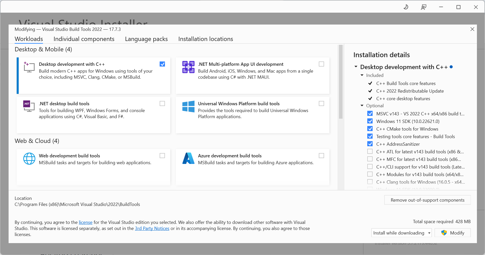

# Installation guide

## Install MS Visual C++ 14.0+

For running this project, Microsoft Visual C++ 14.0 or greater is required.

Get it with `Microsoft Build Tools for Visual Studio` at <https://visualstudio.microsoft.com/downloads/#build-tools-for-visual-studio-2022>

After installing `Visual Studio Installer`, select: `Workloads` → `Desktop development with C++`, then for `Individual Components``, select only:

- Windows SDK
- C++ x64/x86 build tools

The build tools allow using MSVC “cl.exe” C / C++ compiler from the command line.



### Or if you want to install along with Visual Studio

Get it with "Microsoft C++ Build Tools": <https://visualstudio.microsoft.com/visual-cpp-build-tools/>

After installing `Visual Studio Installer`, we need to install `Visual Studio Community 2022` along with below `components` (on right side):

- MSVC v143 - VS 2022 C++ x64/x86 build tools (Latest)
- C++ CMake tools for Windows
- C++ AddressSantizer
- Windows 11 SDK (10.0.x+) [choose the approriate with your Windows & latest one]

## Install the project

After cloning the project, install [`poetry`](https://python-poetry.org/docs/#installing-with-the-official-installer) - Poetry is a tool for dependency management and packaging in Python.

Run `poetry install` & `poetry shell` at the root of the project as `README.md`.

> You may need to run this `pip wheel --use-pep517 "hnswlib (==0.7.0)"` if the installation requires.

You may get errors about missing `dotenv`, `langchain` and `sentence_transformers`, to fix we need to install those packages.

```shell
pip install python-dotenv
pip install langchain
pip install chromadb
pip install sentence_transformers
pip install gpt4all==1.0.3
```

> Because model `ggml-gpt4all-j-v1.3-groovy.bin` compatibilizes with `gpt4all 1.0.3`.

## References

- <https://zs.fyi/archives/python-vc-14-0-error.html>
- <https://www.scivision.dev/python-windows-visual-c-14-required/>
